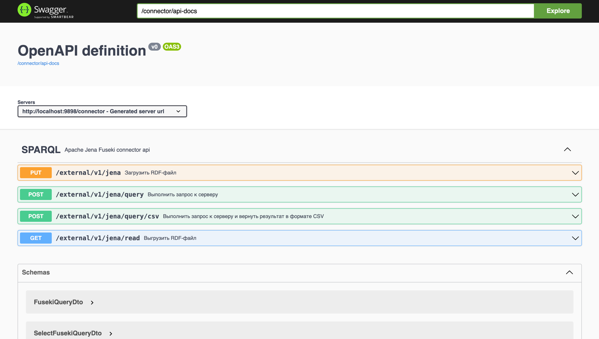
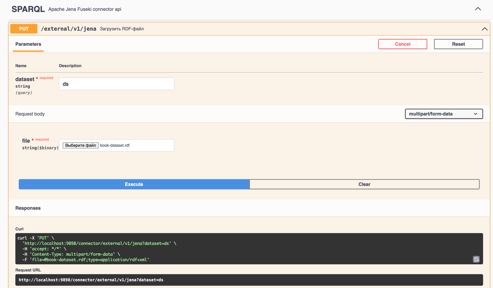
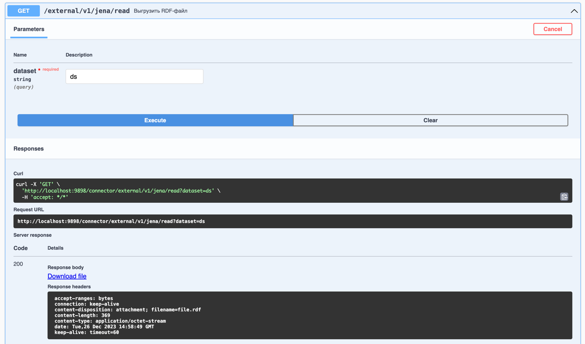
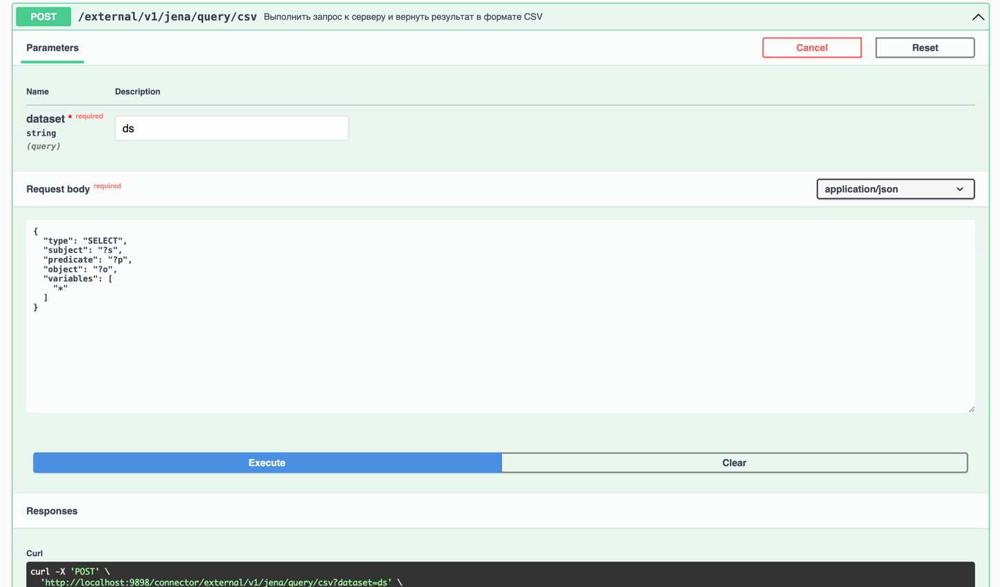

# SPARQL connector
Web connector for Apache Jena Fuseki server with SPARQL queries

## Apache Jena Fuseki server

### Download
Download sources from [jena.apache.org](https://jena.apache.org/download/index.cgi)

### Up server
Start server in downloaded directory, set update flags, in memory or save to drive, set dataset name, e.g.:
```bash
/Users/danilsvishchev/IdeaProjects/apache-jena-fuseki-4.10.0/fuseki-server --update --mem /ds
```

### Start connector
Start connector web application by main class `ru.jena.fuseki.sparqlconnector.SparqlConnectorApplication`

### Open interface
Open browser and set URL
```
http://<host>:9898/connector/swagger-ui/index.html
```
Work with main page and choose request to server


#### Upload data
Set dataset name, choose the file and work upload data request
```curl
curl -X 'PUT' \
  'http://localhost:9898/connector/external/v1/jena?dataset=ds' \
  -H 'accept: */*' \
  -H 'Content-Type: multipart/form-data' \
  -F 'file=@book-dataset.rdf;type=application/rdf+xml'
```
And see response:
```
 connection: keep-alive 
 content-length: 0 
 date: Tue,26 Dec 2023 14:56:14 GMT 
 keep-alive: timeout=60 
```
Use interface for upload data


#### Read data
Set dataset name and choose read data request
```curl
curl -X 'GET' \
  'http://localhost:9898/connector/external/v1/jena/read?dataset=ds' \
  -H 'accept: */*'
```
And see response:
```
 accept-ranges: bytes 
 connection: keep-alive 
 content-disposition: attachment; filename=file.rdf 
 content-length: 369 
 content-type: application/octet-stream 
 date: Tue,26 Dec 2023 14:58:49 GMT 
 keep-alive: timeout=60 
```
Downloaded file:
[file.rdf](data/file.rdf)

Use interface for read data


#### Create query
Set dataset name and create select request
```curl
curl -X 'POST' \
  'http://localhost:9898/connector/external/v1/jena/query/csv?dataset=ds' \
  -H 'accept: */*' \
  -H 'Content-Type: application/json' \
  -d '{
  "type": "SELECT",
  "subject": "?s",
  "predicate": "?p",
  "object": "?o",
  "variables": [
    "*"
  ]
}'
```
And see response:
```
 accept-ranges: bytes 
 connection: keep-alive 
 content-disposition: attachment; filename=file.csv 
 content-length: 303 
 content-type: application/octet-stream 
 date: Tue,26 Dec 2023 15:02:03 GMT 
 keep-alive: timeout=60 
```
Downloaded file:
[file.rdf](data/file.csv)

Use interface for query data and download as csv

